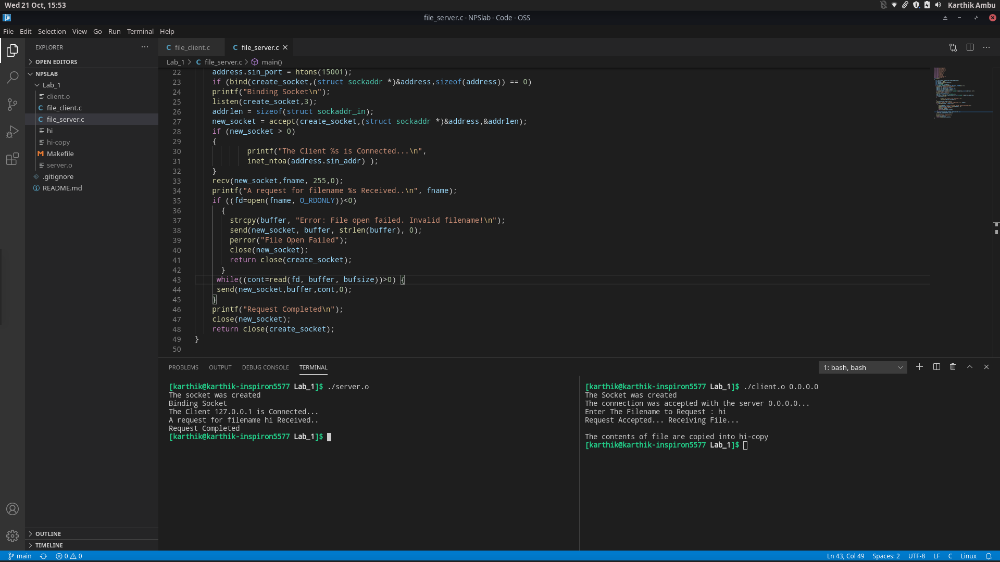
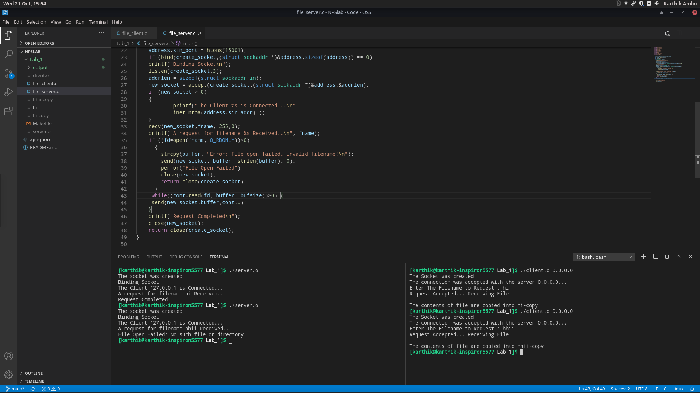

# Lab 1

Lab 1 consisted of a File socket implementation using Linux sockets. 

## Files

- file_client.c

    This file contains the code for managing the client socket. It requests for a file given filename from the server and makes a new file as $filename+"copy"

- file_server.c 

    This file contains the code for managing the server socket. It connects with clients to deliver the contents of a file given the filename. This is done successfully and it also handles errors if any.

- hi

    This file is used for testing file sockets.

- Makefile

    Made for ease of use of compiling and cleaning output files

## Output

### File exists

### File doesn't exist

