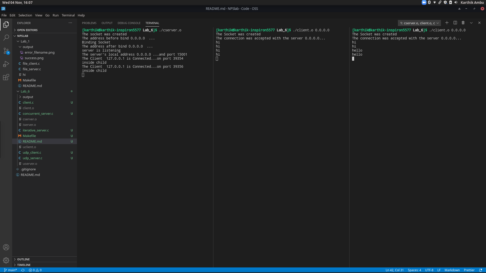
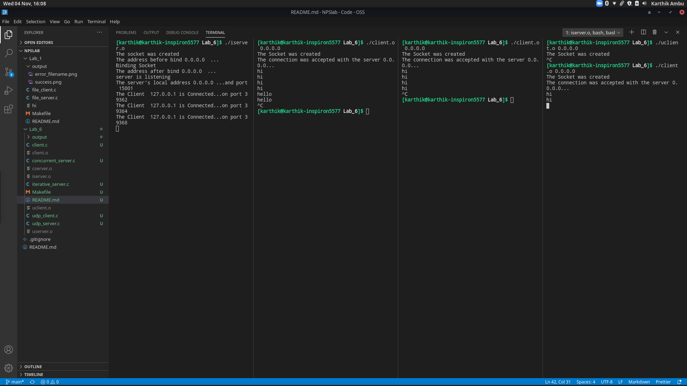

# Lab 1

Lab 6 consisted of implementation of the following:
- Implementation of a concurrent and iterative connection-oriented echo server
- Implementation of a connectionless echo server

## Files

- **client.c**

    Client program for connection-oriented server

- **concurrent_server.c** 

    Concurrent server program for connection-oriented server program

- **iterative_server.c**

    Iterative server program for connection-oriented server program

- **udp_client.c**

    Client for connectionless server

- **udp_server.c**

    Server for connectionless server program

- **Makefile**

    Made for ease of use of compiling and cleaning output files

## Output

### 6A

### 6B

### 6C

