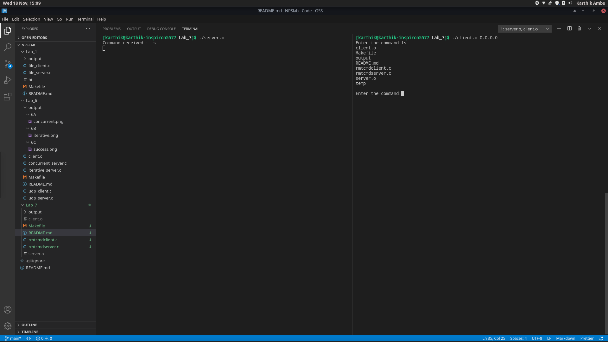
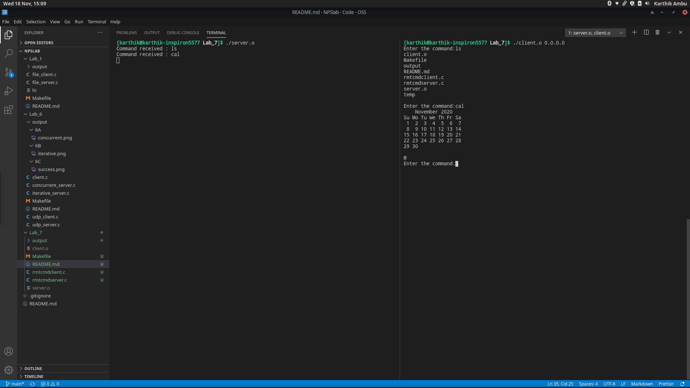
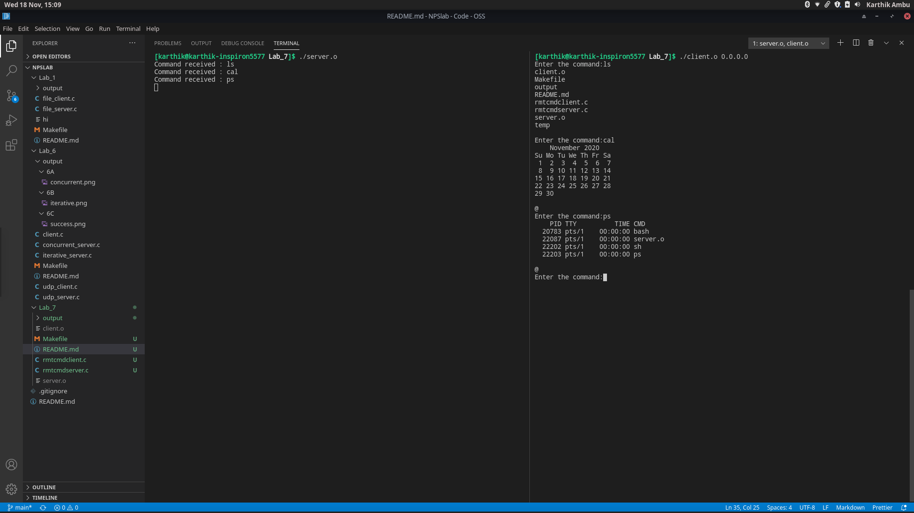
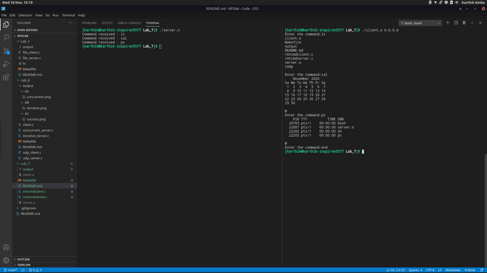

# Lab 7

Lab 7 consisted of remote command execution using sockets

## Files

- **rmtcmdclient.c**

    Client side program for sending remote commands to server to execute

- **rmtcmdserver.c**

    Server side program for receving and executing remote commands from client

- **Makefile**

    Made for ease of use of compiling and cleaning output files

## Output

### ls command

### cal command

### ps command

### Exit remote execution

